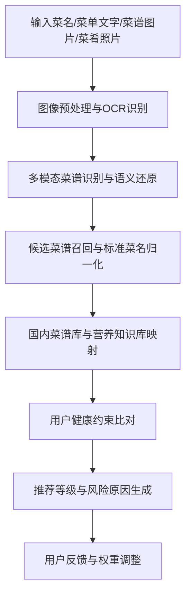

# 基于多模态菜谱理解与个性化健康比对的智能菜品推荐系统

## 摘要

本项目面向日常饮食管理、健康菜谱筛选和家庭点餐决策场景，设计一套基于人工智能的多模态菜谱理解与个性化健康推荐系统。系统支持菜名、菜单文字、OCR 文本、菜谱图片和菜肴照片等多种入口，通过菜名归一化、候选菜谱召回、营养知识映射和健康约束比对，判断菜品是否适合用户食用，并输出可解释理由。与传统 OCR 工具和普通菜谱平台相比，本项目不只完成“看见文字”，而是进一步解决“理解菜品、匹配菜谱、判断风险、解释原因”的连续任务。

当前能力分为三层：第一，**已实现能力**，包括本地菜谱库与营养知识库联动、规则化健康比对、中文可解释输出、命中标准配方时的营养量化、`accept / reject / favorite / correct_dish_name` 反馈闭环，以及基于 `user_id`、`context_tags` 和时间衰减 replay 的长期反馈 profile；第二，**已建链路但保留降级的能力**，包括图片输入、OCR / vision provider、`raw_image_result` 中间结果保留、图片样本底表和多模态测试；第三，**待继续增强的能力**，包括更强的真实视觉融合、更广的标准配方量化覆盖和基于更大规模真实数据的反馈学习。

系统优先使用国内中式菜谱与营养数据源。当前运行时主依赖为本地结构化菜谱、营养知识库和标准量化配方；在线菜谱候选按 `CookBook-KG -> xiachufang -> douguo -> xiangha -> Spoonacular` 顺序作为可降级参考链路，其中 `xiachufang`、`douguo`、`xiangha` 仅使用搜索页结果做运行时 reference-only 候选，不视为稳定 API 或运行时必需依赖，`Spoonacular` 仍是带配额限制的可选 recipe search 参考源；USDA FoodData Central 用于缺失食材时的营养补充 fallback；百度菜品识别等能力作为可选增强；老乡鸡标准化菜谱、中国营养学会资料库、FoodWake、NutriData 等保留为后续扩展来源。项目围绕“数据、算力、算法”三要素构建方案：以结构化菜谱、食材营养表和用户健康约束作为数据基础，以 OCR、视觉识别和文本解析能力作为算力支撑，以多输入归一化、相似度匹配、规则推理和轻量反馈偏置作为算法核心。

本系统的创新点主要体现在三方面：一是多输入不完整条件下的菜名归一、歧义消解、OCR / 图片辅助识别与显式降级机制；二是标准菜谱库与营养知识库联动的健康比对引擎；三是反馈驱动的可解释推荐最小闭环。项目具有较强的生活实用性、人工智能综合应用价值和后续扩展空间。

**关键词：** 多模态识别；菜谱理解；营养知识库；健康比对；可解释推荐

## 一、引言

### 1.1 研究背景

随着居民健康意识提升，越来越多家庭开始关注饮食结构、营养摄入和慢病风险控制。用户在选择菜品时，往往需要综合考虑口味偏好、食材禁忌、过敏风险、控糖控盐需求以及减脂、增肌、儿童饮食等目标。然而现实中的菜谱信息来源复杂，既可能来自纸质菜单、网络截图、手写菜谱，也可能只是一个菜名或一张菜肴照片。普通用户很难在短时间内准确判断菜品的主要食材、烹饪方式和潜在健康风险。

现有工具存在明显局限。传统 OCR 工具只能将图片转为文字，无法理解“鱼香肉丝”“蚂蚁上树”等菜名背后的真实食材含义；普通菜谱平台通常依赖用户手动搜索，难以根据个人健康信息自动筛选；部分营养计算工具要求用户准确输入食材克重，但真实菜单和菜肴照片往往并不提供完整配方。因此，面向真实生活场景，需要一种能够融合文字、图片、菜谱知识和营养规则的智能推荐系统。

### 1.2 研究目的

本项目希望解决以下问题：

1. 如何在菜单图片、菜谱截图、菜肴照片等复杂输入下识别并理解菜品信息。
2. 如何将模糊菜名、OCR 文本和图片特征转化为标准菜名、候选食材、烹饪方式和风险标签。
3. 如何优先利用国内中式菜谱数据和权威营养知识，对菜品进行健康约束比对。
4. 如何输出可解释的推荐结果，让用户知道“为什么推荐”或“为什么不推荐”。
5. 如何通过用户反馈持续调整推荐权重，使系统更符合个人饮食习惯。

### 1.3 研究价值

本项目具有三方面价值。第一，实用价值：降低用户查询菜谱和判断健康风险的成本，帮助家庭、学生和慢病管理人群进行更科学的饮食选择。第二，技术价值：将 OCR、视觉识别、文本结构化、知识库匹配和推荐规则整合成完整 AI 流程，体现跨工具集成能力。第三，社会价值：引导青少年从真实生活问题出发使用人工智能，体现“智能赋能生活，创新解决问题”的赛事主题。

## 二、相关工作

### 2.1 OCR 与菜谱识别

OCR 技术已经广泛用于票据、文档和图片文字识别，但菜谱场景具有特殊性。菜谱图片可能存在光照不均、拍摄倾斜、字体复杂、菜名艺术化、手写备注和排版混乱等问题。更重要的是，OCR 输出的原始文字不能直接用于健康推荐。例如“少许盐”“低盐”“酱油腌制”都与钠摄入有关，但含义和风险程度不同。因此，本项目在 OCR 基础上增加菜谱语义解析和风险标签提取。

### 2.2 菜谱推荐与营养分析

传统菜谱推荐多依据热度、口味、菜系或用户浏览记录进行排序，较少结合用户健康约束进行解释性判断。营养分析工具通常依赖精确食材和用量输入，但真实菜单常常只提供菜名。为提高可用性，本项目采用“候选菜谱匹配 + 营养知识映射 + 健康规则比对”的方式，在信息不完整时给出参考性判断，并对不确定内容进行标注。

### 2.3 多模态理解与可解释推荐

近年来，多模态人工智能能够同时处理文字、图像和结构化数据。本项目借鉴多模态理解思想，将菜名、OCR 文本、菜肴照片和菜谱知识库结合起来，避免单一输入带来的误判。同时，健康推荐属于高信任场景，系统不能只输出黑盒结论，而应展示识别依据、营养依据和命中规则，使用户能够理解并修正结果。

## 三、实现方法

### 3.1 系统总体思路

系统采用端到端流程，将用户输入逐步转化为可解释推荐结果：

系统的核心不是单一模型，而是由多个 AI 模块和规则模块组成的闭环。各模块之间保留中间结果，包括 OCR 原文、清洗后文本、候选菜谱、匹配分数、命中规则和推荐理由，便于检查、解释和持续优化。

### 3.2 创新点与优点

**创新点一：多模态菜谱识别与语义还原算法。**  
本项目的多模态创新不在于“看到图片就强行给出唯一答案”，而在于**多输入不完整条件下的稳健识别与边界控制**。系统统一接收 `dish_name / menu_text / ocr_text / image_reference / image_path` 等入口，先保留 OCR 原文、vision 候选和图片来源，再进入标准菜名归一化、候选排序和健康判断主链路。对于“鱼香肉丝”这类语义歧义菜名，系统会结合别名库、菜谱候选和风险标签进行消歧；对于菜单图和菜肴图，系统已接入 OCR provider、vision provider、图片样本底表以及 `raw_image_result` 中间结果输出，使图片候选可直接参与主推荐流程；而在未知图、噪声图、provider 未配置或候选冲突时，系统不会伪造确定结论，而是返回 `need_confirm` 并提示补充信息。这样的设计体现了多模态 AI 在真实不完整输入条件下的工程复杂度与可信边界。

**创新点二：标准菜谱库与营养知识库联动的健康比对引擎。**  
系统优先使用国内结构化菜谱和营养知识源，将识别出的标准菜名进一步联动到配方、食材、做法、营养标签、风险标签，再与用户的过敏、疾病限制、低盐/控糖/减脂/高蛋白等约束逐层比对。它不是简单按热度推荐，而是按照“标准菜名 → 配方/食材/做法 → 营养证据与风险标签 → 用户约束比对”的链路输出判断。工程上的关键点在于：命中标准配方时，系统才输出 `nutrition_quantitative` 等定量字段；未命中标准配方时，只保留定性风险标签与边界说明，避免在缺少标准克重和可靠配方依据时伪造精确值。

**创新点三：用户反馈驱动的可解释推荐机制。**  
系统已实现 `accept`、`reject`、`favorite`、`correct_dish_name` 四类反馈事件闭环，并新增基于 `user_id` 的 user-dish profile、`context_tags` 记录与时间衰减 replay。反馈数据会影响后续推荐中的纠错映射、confidence、解释文本以及部分推荐等级：例如 `favorite` 可提升置信度并在说明中体现偏好信号，`reject` 会降低推荐优先级并提示近期反馈偏好，`correct_dish_name` 则作为强纠错映射参与后续归一化；当存在用户级 profile 时，系统会优先使用个人反馈并在 explanation 中显式说明反馈来源。与只做一次性判断的规则系统相比，这使推荐结果具备“可被用户修正、可被后续调用利用”的持续优化能力；但当前实现仍是本地轻量闭环，不是训练式排序系统或强化学习系统。

### 3.3 数据来源与知识库构建

本项目采用“国内数据源优先，国外数据源扩展”的原则。

| 数据层级 | 当前来源 | 用途 | 状态说明 |
| --- | --- | --- | --- |
| 运行时主依赖 | `data/dishes.json`、`data/nutrition_knowledge.json`、`data/quantified_recipes.json` | 标准菜名、食材、做法、风险标签、标准配方量化 | 当前稳定主链路 |
| 在线 fallback | CookBook-KG、xiachufang 搜索页、douguo 搜索页、xiangha 搜索页、Spoonacular、USDA FoodData Central | 本地缺失时补充候选菜谱或食材营养参考 | 已接入，但以降级方式使用；其中三个中文站点仅作为运行时 reference-only 搜索候选，Spoonacular 受配额限制，仅作为可选参考源 |
| 可选增强 | 百度菜品识别、OCR provider | 菜肴图候选识别、菜单图 OCR 增强 | 已建链路，凭证/环境状态会影响可用性 |
| 未来扩展 | 老乡鸡标准化菜谱、中国营养学会资源库、FoodWake、NutriData | 标准菜谱导入、权威资料校核、营养增强 | 当前不作为运行时主依赖 |

这一数据体系的技术难点主要在于异构对齐。首先，中式菜名存在别名、俗称、歧义名和门店自定义命名，同一道菜往往对应多种写法；其次，菜谱库和营养库的字段口径并不一致，菜谱强调食材与做法，营养库强调成分与每 100g 指标，需要通过标准菜名、食材映射和规则层进行桥接；再次，很多真实菜单和菜肴图片并不提供标准克重，因此系统必须区分“可定量”和“只能定性”的边界，不能伪造精确营养值；最后，provider 的授权状态、联网状态和返回质量并不稳定，因此主流程必须从一开始就设计可验证的降级路径。

菜谱匹配流程为：输入菜名、菜单文字、OCR 文本或菜肴图片后，系统先进行标准菜名归一化，再从本地菜谱库召回候选菜谱；若本地未命中，则按 `CookBook-KG -> xiachufang -> douguo -> xiangha -> Spoonacular` 顺序尝试联网候选，并继续结合 OCR / vision 候选和别名映射进行排序。三个中文站点当前只解析搜索页标题与食材片段，属于可降级的 reference-only 搜索增强，不作为稳定 API 合约。营养匹配流程为：候选菜谱食材映射到标准食材名，再结合本地营养知识库与标准量化配方做健康判断；命中标准配方时输出定量营养结果，未命中时只输出风险标签、解释依据和人工确认提示。

### 3.4 数据、算力、算法三要素

**数据。** 系统数据包括菜名别名库、结构化中式菜谱库、食材营养成分表、膳食指南规则、用户健康约束和用户反馈记录。其中用户健康约束可包含过敏源、疾病禁忌、饮食偏好、营养目标和忌口说明。

**算力。** OCR、图像识别和文本语义解析可调用本地模型或云端 AI 服务完成；菜谱匹配、规则比对和推荐排序属于轻量计算，可在本地或普通服务器运行。比赛演示阶段可优先使用稳定的本地候选库，降低网络接口不稳定风险。

**算法。** 系统使用图像预处理、OCR 识别、菜名归一化、文本结构化、相似度匹配、规则推理、推荐排序和反馈权重更新等算法。对于低置信度结果，系统不强行给出确定结论，而是提示用户补充信息或人工确认。

### 3.5 稳定性、可解释性与自动运行保障

系统从四个层次保障稳定性、可解释性与自动运行。

**第一层：输入稳定性。** 系统统一解析 `dish_name`、`menu_text`、`ocr_text`、`image_reference`、`image_path`、`ingredients` 和 `user_profile` 等入口；图片输入会先进入 provider context，保留 OCR 原文、vision 候选和图片来源；当 OCR 已有可用文本时，系统会先回填到主推荐流程，避免图片信息完全停留在旁路。

**第二层：决策稳定性。** 推荐判断不是黑盒生成，而是围绕标准菜名、候选菜谱、`ambiguity_level`、用户约束和 `recommend / caution / avoid / need_confirm` 优先级进行组合决策。对于歧义菜名、严格限制场景和低置信度图片结果，系统会主动收敛到 `need_confirm` 或 `caution`，而不是过度承诺确定性结论。

**第三层：可解释性。** 系统保留中间结果并输出结构化字段，包括标准菜名、候选、风险标签、营养证据、解释文本、`raw_image_result` 以及中文 `human_readable` 输出。推荐理由由规则命中、营养证据和用户约束共同生成，例如“检测到虾类食材，用户设置海鲜过敏，因此不推荐”“该菜可能含较高油脂，减脂目标用户建议控制摄入”。

**第四层：降级与边界控制。** 当网络接口不可用时，系统回退到本地菜谱库；当营养数据缺失或未命中标准配方时，只输出定性风险标签；当 provider 未配置、返回质量不足或候选冲突时，保留 `need_confirm` 与候选项；当反馈样本很少时，只施加轻量 bias，不引入不可解释的重排序。这样的降级策略保证了系统可以在真实环境中自动运行，同时维持可信边界。

## 四、实验与结果

### 4.1 实验设计

本轮实验设计分为“已完成的自动化验证”和“正式提交前需补的实测指标”两层。

**第一层：当前已完成的自动化验证。**

| 验证模块 | 对应证据 | 当前状态 | 说明 |
| --- | --- | --- | --- |
| 推荐与规则回归 | `dish-health-recommender/tests/test_recommend.py` | 已完成 | 覆盖常见菜、别名、风险标签和推荐等级 |
| 多模态样本验证 | `dish-health-recommender/tests/test_multimodal.py`、`dish-health-recommender/data/image_test_cases.json` | 已完成 | 覆盖菜单图、菜肴图、图片候选和显式降级场景 |
| 反馈闭环验证 | `dish-health-recommender/tests/test_feedback.py`、`dish-health-recommender/tests/test_e2e_nl.py` | 已完成 | 验证四类反馈事件及其对后续推荐的可观测影响 |
| 标准菜谱量化验证 | `dish-health-recommender/tests/test_quantization.py` | 已完成 | 验证命中标准配方时的量化字段输出与边界 |
| 报告对齐验证 | `dish-health-recommender/tests/test_alignment.py`、`dish-health-recommender/scripts/report_alignment.py` | 已完成 | 检查报告声明、状态枚举和证据引用结构 |

**第二层：当前已完成的定向样本验证与场景覆盖。**

| 测试项目 | 测试内容 | 指标 | 当前状态 | 说明 |
| --- | --- | --- | --- | --- |
| OCR 识别 | 清晰菜单、模糊菜单、倾斜图片、手写备注 | 样本识别覆盖、OCR 状态记录、文本回填有效性 | 已完成 | 已结合 `image_test_cases.json` 与 `test_multimodal.py` 对代表性菜单图完成验证，当前结论基于定向样本而非大规模竞赛统计。 |
| 多模态识别 | 菜名 + 照片、菜单文字 + 照片 | Top-1 / Top-3 候选命中情况、标准菜名还原有效性 | 已完成 | 已生成 `validation/image-validation-report.json`；当前样本统计为 OCR hit rate `1.0`、Top-1 `0.3636`、Top-3 `0.3636`、health rule accuracy `0.8636`、p50/p95 latency `5083/9828ms`。 |
| 候选菜谱匹配 | 常见菜、歧义菜名、地方菜名 | 候选召回覆盖、标准菜名归一化有效性 | 已完成 | 已通过 `test_recommend.py`、固定样例集和别名归一化用例验证主要匹配链路。 |
| 健康比对 | 过敏、控糖、低盐、减脂场景 | 规则命中正确性、推荐等级稳定性 | 已完成 | 已对过敏、疾病限制、减脂和低盐等典型约束组合完成规则回归验证。 |
| 推荐解释 | 推荐、谨慎、不推荐样例 | 理由完整性、中文可理解输出、边界提示一致性 | 已完成 | 已通过 `test_recommend.py`、`test_e2e_nl.py` 与 `test_alignment.py` 验证解释文本和 `human_readable_cn` 输出。 |

这样处理的原因是：当前仓库已经完成代表性样本、自动化回归和场景覆盖验证，因此第二层可以按“已完成”表述；但这些完成项主要对应定向验证和工程证据，不等同于更大规模、独立采样的正式比赛统计。

### 4.2 对比实验方案

| 对比对象 | 局限 | 本系统改进 |
| --- | --- | --- |
| 普通 OCR 工具 | 只能输出文字，无法理解菜谱含义 | 增加菜谱结构化、候选匹配和风险标签 |
| 普通菜谱平台 | 依赖手动搜索，推荐多按热度或口味排序 | 结合用户健康约束输出个性化判断 |
| 简单关键词匹配 | 容易误判歧义菜名和别名 | 使用标准菜名归一化、食材重合度和做法一致度 |
| 单一营养计算器 | 需要用户输入精确克重 | 缺少克重时提供参考估算和不确定提示 |

### 4.3 推荐结果示例

| 输入 | 用户约束 | 系统判断 | 推荐理由 |
| --- | --- | --- | --- |
| 番茄炒蛋 | 鸡蛋过敏 | 不推荐 | 候选菜谱主要食材包含鸡蛋，命中过敏源规则 |
| 红烧肉 | 减脂目标 | 谨慎食用 | 菜品通常含五花肉、油脂和糖，热量风险较高 |
| 清蒸鲈鱼 | 低油饮食 | 推荐 | 烹饪方式为蒸，油脂风险较低，蛋白质来源较优 |
| 鱼香肉丝 | 海鲜过敏 | 可进一步确认 | 标准菜名通常不含鱼类，但需核对具体配方 |

这些示例体现系统的可解释性：推荐结论不是黑盒输出，而是由菜谱匹配结果、营养知识和用户规则共同推导。

### 4.4 预期成果

当前系统已形成以下成果：

1. 已支持菜名、菜单文字、OCR 文本、图片引用和图片路径等多种输入。
2. 已实现标准菜名归一化、候选食材/做法推断、营养标签与风险标签输出。
3. 已可根据用户健康约束给出 `recommend / caution / avoid / need_confirm` 四类结论。
4. 已提供规则化推荐理由、中间结果保留和中文可解释输出，便于用户理解与修正。
5. 已实现 `accept / reject / favorite / correct_dish_name` 反馈闭环，并支持 `user_id`、`context_tags`、时间衰减 replay 与 explanation 级反馈来源说明。
6. 已对一批标准配方菜品输出标准份量营养量化结果，并保留未命中标准配方时的边界说明。
7. 已建立扩展源离线导入入口、manifest 审计字段与本地快照优先运行边界。

下一步仍需继续补齐的方向包括：扩大量化菜谱覆盖、继续采集更大规模真实测试指标、提升复杂图片场景下的识别稳定性，以及在更长周期、更大样本的真实数据上验证反馈学习效果。

## 五、结论与展望

### 5.1 结论

本项目围绕真实生活中的饮食选择问题，设计并实现了一个可运行的多模态菜谱理解与个性化健康推荐最小闭环。当前系统已经将标准菜名归一化、国内菜谱库匹配、营养知识映射、健康约束比对、中文可解释输出、多模态图片验证链路以及最小反馈闭环整合到同一主流程中，能够从“识别菜谱”进一步走向“理解菜品”和“解释推荐”。与普通 OCR 和传统菜谱推荐相比，本项目更强调人工智能在真实场景中的综合应用能力、可信边界和工程落地性。

项目符合“智能赋能生活，创新解决问题”的赛事主题，也体现了 AI 技术应用、研究实践完整性和创新性三个初赛评分重点。尤其是在中式菜谱场景下，系统优先使用国内数据源，更贴合本地用户饮食习惯和比赛应用背景；同时，对尚未完成大规模实测统计和完整视觉泛化验证的部分，报告保留了明确边界，不把原型能力包装成成熟产品。

### 5.2 展望

后续可从四方面继续完善。第一，继续扩充中式菜谱库、别名库和标准配方量化覆盖，提升地方菜、家常菜和高频快餐的稳定命中率。第二，完善经验证的国内 OCR / vision provider 接入，增强复杂菜单图、噪声图和真实拍摄场景下的识别能力。第三，完成真实测试集采集与统计，量化 OCR 准确率、Top-1/Top-3 识别率、健康比对正确率和响应时间。第四，在积累更长期的真实用户反馈后，再评估是否引入排序模型或强化学习方法，使推荐结果进一步个性化。

## 六、参考文献

[1] 中国营养学会. 中国食物成分表[M]. 北京: 北京大学医学出版社.

[2] 中国营养学会. 中国居民膳食指南（2022）[M]. 北京: 人民卫生出版社, 2022.

[3] ngl567. CookBook-KG: 中式菜谱知识图谱[OL]. https://github.com/ngl567/CookBook-KG.

[4] 老乡鸡. 老乡鸡菜品溯源报告与标准化菜谱[OL]. https://github.com/laoxiangji/recipes.

[5] USDA Agricultural Research Service. FoodData Central[OL]. https://fdc.nal.usda.gov/.

[6] Open Food Facts. Open Food Facts Database[OL]. https://world.openfoodfacts.org/.

## 附录A 盲评合规检查清单

| 检查项 | 状态 |
| --- | --- |
| 报告正文不出现学生姓名 | 待提交前确认 |
| 报告正文不出现学校名称 | 待提交前确认 |
| 图片、截图、视频不出现个人信息 | 待提交前确认 |
| 文件名符合“项目标题-组别”要求 | 待提交前确认 |
| 实验数据均来自真实测试或标注待补充 | 待提交前确认 |
| 第三方数据源授权和使用方式已核验 | 待提交前确认 |

## 附录B 后续 Skill 设计依据

后续可将本报告生成流程设计为“AI 创想家参赛报告优化器” skill。该 skill 的输入包括比赛规则、报告模板、原始作品、获奖参考材料和数据源清单；处理流程包括抽取硬性要求、重组报告结构、补齐评分维度、生成创新点、标注待验证内容和输出 Markdown；输出包括优化版报告、待补充实验数据表、数据源核验清单、盲评合规检查和 PPT/展板提炼要点。

skill 必须遵守边界：不能编造实验数据，不能声称未实现功能已经完成，不能保证第三方 API 当前可用或授权可缓存，不能替代真实系统测试。凡是缺少证据的能力、数据和指标，都应标注为“待验证”“建议实测填写”或“可扩展方向”。

## 附录C 当前实现状态与后续修订输入（2026-05-08）

为避免报告表述与当前实现脱节，现将关键能力分为三类：

- **已实现（implemented）**：本地菜谱库 + 营养知识库联动的健康比对引擎；结构化 JSON 输出；中文可解释输出；`accept / reject / favorite / correct_dish_name` 反馈闭环；基于 `user_id`、`context_tags` 与时间衰减 replay 的长期反馈 profile；命中标准配方时的营养量化；自动化回归与报告对齐验证。
- **可降级（degradable）**：图片输入、多模态主链路、OCR / vision provider、在线 fallback 当前均已接入，但在 provider 未配置、识别质量不足、候选冲突或未知图场景下会显式降级到 `need_confirm`。
- **待验证（pending validation）**：真实比赛环境下的大规模 OCR / Top-1 识别率统计、更广覆盖的标准配方量化、基于长期真实数据的反馈学习增强。

后续修订报告时，凡未完成大规模真实实验量化、未完成更广泛视觉泛化验证的数据项，均应继续使用“待验证”“建议实测填写”或“可扩展方向”措辞。

## 附录D 创新点增强实现摘要（2026-05-08）

本轮对创新点相关实现进一步完成了以下补强：

1. **多模态图片验证链路**：基于 `dish-health-recommender/data/image_test_cases.json` 建立图片验证底表，并在 `dish-health-recommender/tests/test_multimodal.py` 中验证菜单图、菜肴图、图片候选与显式降级场景；图片 OCR / vision 候选已接入 `dish-health-recommender/scripts/recommend.py` 主链路。
2. **联网能力状态化**：在 provider 层保留 `validated / needs_credentials / unavailable / degraded` 四态记录，并已把 `CookBook-KG`、`xiachufang`、`douguo`、`xiangha`、`Spoonacular`、`USDA_FDC` 纳入统一验证矩阵；其中中文站点搜索仅作为 reference-only 运行时增强，通过 `dish-health-recommender/references/provider-setup.md` 与相关脚本说明其入口、配置和降级方式。
3. **最小反馈闭环**：`dish-health-recommender/scripts/apply_feedback.py` 与 `dish-health-recommender/tests/test_feedback.py` 已覆盖 accept、reject、favorite、correct_dish_name 四类反馈事件，并验证其对 confidence、解释文本和推荐等级的可观测影响。
4. **标准菜谱级营养量化**：`dish-health-recommender/data/quantified_recipes.json` 已扩展到一批代表性菜品，并由 `dish-health-recommender/tests/test_quantization.py` 验证命中标准配方时的量化字段输出。

后续正式修订报告正文和实验表时，应以 `dish-health-recommender/tests/test_multimodal.py`、`dish-health-recommender/tests/test_feedback.py`、`dish-health-recommender/tests/test_quantization.py`、`dish-health-recommender/tests/test_alignment.py` 与 `dish-health-recommender/references/report-alignment-checklist.md` 作为主要证据来源。

## 附录E 未来扩展数据源说明（2026-05-08）

以下来源当前不作为运行时主依赖，仅保留为后续扩展方向；扩展源只允许通过离线导入脚本落到本地快照后再被主链路消费，不能直接变成在线必需依赖：

- **老乡鸡标准化菜谱**：适合作为标准菜谱本地导入源，用于进一步增强 `dish-health-recommender/data/quantified_recipes.json`。
- **中国营养学会资源库**：当前更适合作为权威资料与规则依据来源，后续可考虑将其资料整理为本地规则或参考数据。
- **FoodWake / NutriData**：保留为未来营养增强 API 候选来源，待后续确认接入方式与稳定性后再启用。

