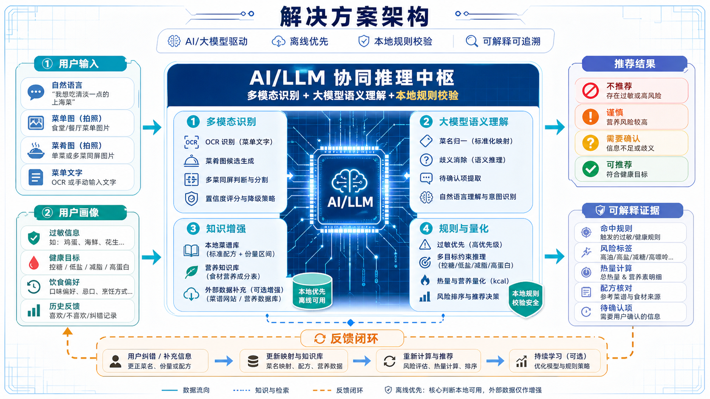

# 菜肴健康分析与个性化推荐系统

**副标题：基于 AI/LLM 协同推理的健康饮食推荐方案**

## 摘要

本项目面向日常饮食管理、健康菜谱筛选和家庭点餐决策场景，设计并实现“菜肴健康分析与个性化推荐系统”。系统支持菜名、菜单文字、OCR 文本、菜谱图片和菜肴照片等多种入口，通过菜名归一化、候选菜谱召回、营养知识映射和健康约束比对，判断菜品是否适合用户食用，并输出可解释理由。与传统 OCR 工具和普通菜谱平台相比，本项目不只完成“看见文字”，而是进一步解决“理解菜品、匹配菜谱、判断风险、解释原因”的连续任务。

当前系统已实现本地菜谱库与营养知识库联动、规则化健康比对、中文可解释输出、命中标准配方时的营养量化、未命中精确配方时的区间估算，以及 `accept / reject / favorite / correct_dish_name / set_user_profile` 反馈闭环。图片输入、OCR / vision provider 和在线菜谱候选已接入主流程，但这些能力会根据凭证、网络和候选质量自动降级；当证据不足时，系统会返回 `need_confirm`，而不是给出没有依据的确定判断。

系统采用本地优先、在线增强的技术路线。运行时主依赖为本地结构化菜谱、营养知识库和标准量化配方；在线候选只作为可降级参考，按 `CookBook-KG -> xiachufang -> douguo -> xiangha -> Spoonacular` 顺序补充本地缺失内容；百度菜品识别等能力作为可选图片增强，不作为系统必需条件。项目围绕“数据、算力、算法”三要素构建方案：以结构化菜谱、食材营养表和用户健康约束作为数据基础，以 OCR、视觉识别和文本解析能力作为算力支撑，以多输入归一化、相似度匹配、规则推理和轻量反馈偏置作为算法核心。

本系统的创新点主要体现在四方面：一是多输入不完整条件下的菜名归一、歧义消解、OCR / 图片辅助识别与显式降级机制；二是健康约束驱动的个性化推荐规则引擎，能把过敏、控糖、低盐、减脂等限制转化为推荐等级；三是多源知识增强的标准菜谱与营养量化机制，在弱网或断网时仍以本地结构化知识完成核心判断，并区分精确标准份量与常见范围估算；四是人工反馈闭环与可解释更新机制，支持用户确认、拒绝、收藏、纠错和用户画像更新后重算推荐。项目具有较强的生活实用性、人工智能综合应用价值和后续扩展空间。

**关键词：** 多模态识别；菜谱理解；营养知识库；健康比对；可解释推荐

## 一、引言

### 1.1 研究背景

随着居民健康意识提升，越来越多家庭开始关注饮食结构、营养摄入和慢病风险控制。用户在选择菜品时，往往需要综合考虑口味偏好、食材禁忌、过敏风险、控糖控盐需求以及减脂、增肌、儿童饮食等目标。然而现实中的菜谱信息来源复杂，既可能来自纸质菜单、网络截图、手写菜谱，也可能只是一个菜名或一张菜肴照片。普通用户很难在短时间内准确判断菜品的主要食材、烹饪方式和潜在健康风险。

现有工具存在明显局限。传统 OCR 工具只能将图片转为文字，无法理解“鱼香肉丝”“蚂蚁上树”等菜名背后的真实食材含义；普通菜谱平台通常依赖用户手动搜索，难以根据个人健康信息自动筛选；部分营养计算工具要求用户准确输入食材克重，但真实菜单和菜肴照片往往并不提供完整配方。因此，面向真实生活场景，需要一种能够融合文字、图片、菜谱知识和营养规则的智能推荐系统。

### 1.2 研究目的

本项目希望解决以下问题：

1. 如何在菜单图片、菜谱截图、菜肴照片等复杂输入下识别并理解菜品信息。
2. 如何将模糊菜名、OCR 文本和图片特征转化为标准菜名、候选食材、烹饪方式和风险标签。
3. 如何优先利用国内中式菜谱数据和权威营养知识，对菜品进行健康约束比对。
4. 如何输出可解释的推荐结果，让用户知道“为什么推荐”或“为什么不推荐”。
5. 如何通过用户反馈持续调整推荐权重，使系统更符合个人饮食习惯。

### 1.3 研究价值

本项目具有三方面价值。第一，实用价值：降低用户查询菜谱和判断健康风险的成本，帮助家庭、学生和慢病管理人群进行更科学的饮食选择。第二，技术价值：将 OCR、视觉识别、文本结构化、知识库匹配和推荐规则整合成完整 AI 流程，体现跨工具集成能力。第三，社会价值：引导用户从真实生活问题出发使用人工智能，体现“智能赋能生活，创新解决问题”的产品定位。

## 二、相关工作

### 2.1 OCR 与菜谱识别

OCR 技术已经广泛用于票据、文档和图片文字识别，但菜谱场景具有特殊性。菜谱图片可能存在光照不均、拍摄倾斜、字体复杂、菜名艺术化、手写备注和排版混乱等问题。更重要的是，OCR 输出的原始文字不能直接用于健康推荐。例如“少许盐”“低盐”“酱油腌制”都与钠摄入有关，但含义和风险程度不同。因此，本项目在 OCR 基础上增加菜谱语义解析和风险标签提取。

### 2.2 菜谱推荐与营养分析

传统菜谱推荐多依据热度、口味、菜系或用户浏览记录进行排序，较少结合用户健康约束进行解释性判断。营养分析工具通常依赖精确食材和用量输入，但真实菜单常常只提供菜名。为提高可用性，本项目采用“候选菜谱匹配 + 营养知识映射 + 健康规则比对”的方式，在信息不完整时给出参考性判断，并对不确定内容进行标注。

### 2.3 多模态理解与可解释推荐

近年来，多模态人工智能能够同时处理文字、图像和结构化数据。本项目借鉴多模态理解思想，将菜名、OCR 文本、菜肴照片和菜谱知识库结合起来，避免单一输入带来的误判。同时，健康推荐属于高信任场景，系统不能只输出黑盒结论，而应展示识别依据、营养依据和命中规则，使用户能够理解并修正结果。

## 三、实现方法

### 3.1 系统总体思路

系统采用端到端流程，将用户输入逐步转化为可解释推荐结果：

图 3-1 系统解决方案架构图：输入层、AI / LLM 多模态理解层、本地知识与规则层、用户画像反馈层共同形成可降级的健康推荐闭环。

系统的核心不是单一模型，而是由多个 AI 模块和规则模块组成的闭环。各模块之间保留中间结果，包括 OCR 原文、清洗后文本、候选菜谱、匹配分数、命中规则和推荐理由，便于检查、解释和持续优化。

### 3.2 创新点与优点

**创新点一：多模态菜谱识别与语义还原算法。**  
本项目的多模态创新不在于“看到图片就强行给出唯一答案”，而在于**多输入不完整条件下的稳健识别与边界控制**。系统统一接收 `dish_name / menu_text / ocr_text / image_reference / image_path` 等入口，先保留 OCR 原文、vision 候选和图片来源，再进入标准菜名归一化、候选排序和健康判断主链路。对于“鱼香肉丝”这类语义歧义菜名，系统会结合别名库、菜谱候选和风险标签进行消歧；对于菜单图和菜肴图，系统已接入 OCR provider、vision provider、图片样本底表以及 `raw_image_result` 中间结果输出，使图片候选可直接参与主推荐流程；而在未知图、噪声图、provider 未配置或候选冲突时，系统不会伪造确定结论，而是返回 `need_confirm` 并提示补充信息。这样的设计体现了多模态 AI 在真实不完整输入条件下的工程复杂度与可信边界。

**创新点二：标准菜谱库与营养知识库联动的健康比对引擎。**  
系统优先使用国内结构化菜谱和营养知识源，将识别出的标准菜名进一步联动到配方、食材、做法、营养标签、风险标签，再与用户的过敏、疾病限制、低盐/控糖/减脂/高蛋白等约束逐层比对。它不是简单按热度推荐，而是按照“标准菜名 → 配方/食材/做法 → 营养证据与风险标签 → 用户约束比对”的链路输出判断。工程上的关键点在于：命中标准配方时，系统才输出 `nutrition_quantitative` 等定量字段；未命中标准配方时，只保留定性风险标签与边界说明，避免在缺少标准克重和可靠配方依据时伪造精确值。

**创新点三：多源知识增强的标准菜谱与营养量化机制。**  
系统把本地结构化菜谱、营养知识库、标准量化配方和可选外部候选源组合起来，优先使用可复核的本地数据完成核心推荐，再把 CookBook-KG、中文菜谱站点、Spoonacular、百度菜品识别等外部来源作为补充候选。这样既能在网络条件差时保留可运行能力，又能在数据缺口处逐步扩展地方菜、标准配方和热量估算覆盖。量化输出分两类：命中标准配方时输出 `nutrition_quantitative` 和分项计算，例如提拉米苏约 390 kcal、草头圈子约 430 kcal；未命中精确配方但本地有常见菜谱参考时，只输出 `nutrition_quantitative_range`，例如鱼香肉丝热量约 250-450 千卡，并明确“常见范围估算，不是实测克重”。

**创新点四：用户反馈驱动的可解释推荐机制。**  
系统已实现 `accept`、`reject`、`favorite`、`correct_dish_name` 和 `set_user_profile` 五类反馈事件闭环，并新增基于 `user_id` 的 user-dish profile、`context_tags` 记录、时间衰减 replay 与用户画像层。反馈数据会影响后续推荐中的纠错映射、confidence、解释文本以及部分推荐等级：例如 `favorite` 可提升置信度并在说明中体现偏好信号，`reject` 会降低推荐优先级并提示近期反馈偏好，`correct_dish_name` 则作为强纠错映射参与后续归一化。`set_user_profile` 会把过敏、疾病相关限制和长期忌口写入 `persistent_constraints`，把最近减脂、低盐、控糖等阶段目标写入 `temporary_goals`；后续请求带同一 `user_id` 时，系统会自动合并这些已确认信息，并在结果中返回 `applied_user_profile`。与只做一次性判断的规则系统相比，这使推荐结果具备“可被用户修正、可被后续调用利用”的持续优化能力；但当前实现仍是本地轻量闭环，不是训练式排序系统或强化学习系统。

### 3.3 数据来源与知识库构建

本项目采用“国内数据源优先，国外数据源扩展”的原则。

| 数据层级 | 当前来源 | 用途 | 状态说明 |
| --- | --- | --- | --- |
| 运行时主依赖 | `data/dishes.json`、`data/nutrition_knowledge.json`、`data/quantified_recipes.json` | 标准菜名、食材、做法、风险标签、标准配方量化 | 当前稳定主链路 |
| 在线 fallback | CookBook-KG、xiachufang 搜索页、douguo 搜索页、xiangha 搜索页、Spoonacular、USDA FoodData Central | 本地缺失时补充候选菜谱或食材营养参考 | 已接入，但以降级方式使用；其中三个中文站点仅作为运行时 reference-only 搜索候选，Spoonacular 受配额限制，仅作为可选参考源 |
| 可选增强 | 百度菜品识别、OCR provider | 菜肴图候选识别、菜单图 OCR 增强 | 已建链路，凭证/环境状态会影响可用性 |
| 未来扩展 | 老乡鸡标准化菜谱、中国营养学会资源库、FoodWake、NutriData | 标准菜谱导入、权威资料校核、营养增强 | 当前不作为运行时主依赖 |

这一数据体系的技术难点主要在于异构对齐。首先，中式菜名存在别名、俗称、歧义名和门店自定义命名，同一道菜往往对应多种写法；其次，菜谱库和营养库的字段口径并不一致，菜谱强调食材与做法，营养库强调成分与每 100g 指标，需要通过标准菜名、食材映射和规则层进行桥接；再次，很多真实菜单和菜肴图片并不提供标准克重，因此系统必须区分“可定量”和“只能定性”的边界，不能伪造精确营养值；最后，provider 的授权状态、联网状态和返回质量并不稳定，因此主流程必须从一开始就设计可验证的降级路径。

菜谱匹配流程为：输入菜名、菜单文字、OCR 文本或菜肴图片后，系统先进行标准菜名归一化，再从本地菜谱库召回候选菜谱；若本地未命中，则按 `CookBook-KG -> xiachufang -> douguo -> xiangha -> Spoonacular` 顺序尝试联网候选，并继续结合 OCR / vision 候选和别名映射进行排序。三个中文站点当前只解析搜索页标题与食材片段，属于可降级的 reference-only 搜索增强，不作为稳定 API 合约。营养匹配流程为：候选菜谱食材映射到标准食材名，再结合本地营养知识库与标准量化配方做健康判断；命中标准配方时输出定量营养结果，未命中时只输出风险标签、解释依据和人工确认提示。

### 3.4 数据、算力、算法三要素

**数据。** 系统数据包括菜名别名库、结构化中式菜谱库、食材营养成分表、膳食指南规则、用户健康约束和用户反馈记录。其中用户健康约束可包含过敏源、疾病禁忌、饮食偏好、营养目标和忌口说明；已确认的长期约束与阶段目标会分别存入 `persistent_constraints` 和 `temporary_goals`，避免把一次普通提问误记为长期健康限制。

**算力。** OCR、图像识别和文本语义解析可调用本地模型或云端 AI 服务完成；菜谱匹配、规则比对和推荐排序属于轻量计算，可在本地或普通服务器运行。当网络条件差、外部接口限流或第三方服务不可用时，系统可优先使用稳定的本地候选库和规则引擎，降低外部接口波动对核心推荐的影响。

**算法。** 系统使用图像预处理、OCR 识别、菜名归一化、文本结构化、相似度匹配、规则推理、推荐排序和反馈权重更新等算法。对于低置信度结果，系统不强行给出确定结论，而是提示用户补充信息或人工确认。

### 3.5 稳定性、可解释性与自动运行保障

这一节主要回答三个问题：用户输入不完整时，系统怎样避免误判；系统为什么给出这个推荐；网络或外部接口不稳定时，核心功能还能不能继续使用。系统仍然从输入、决策、解释和降级四个层次保障稳定性，但表达上更贴近用户实际使用过程。

**第一，先把输入整理清楚。** 用户可能只输入一个菜名，也可能发菜单图片、菜肴照片，或者直接说“我低盐，能不能吃这个”。系统会先把这些信息整理成统一字段，例如 `dish_name`、`menu_text`、`ocr_text`、`image_path`、`ingredients` 和 `user_profile`。图片识别不会直接决定最终结论，而是先产生 OCR 原文、视觉候选和图片来源记录，再进入后续判断。

**第二，推荐结论按固定规则生成。** 系统不会直接让模型随口回答“能吃”或“不能吃”，而是先找标准菜名和候选配方，再检查过敏、低盐、控糖、减脂等约束。过敏这类硬限制优先级最高；菜名模糊、图片低置信度或配方缺失时，系统会给出 `need_confirm` 或 `caution`，而不是强行猜测。

**第三，每个结论都要能解释。** 推荐结果会保留标准菜名、候选菜谱、风险标签、营养证据、解释文本、`raw_image_result` 和中文 `human_readable` 输出。用户能看到系统为什么判断这道菜不适合，例如“检测到虾类食材，用户设置海鲜过敏，因此不推荐”，也能看到哪些信息还需要确认。

**第四，不确定时主动降级。** 当网络不可用时，系统优先使用本地菜谱库和本地规则；当没有标准克重时，不输出伪精确热量；当 provider 未配置、图片识别质量不足或候选冲突时，保留候选并请用户确认；当反馈样本很少时，只做轻量调整，不进行不可解释的重排序。这样可以保证系统上线后在真实环境中更稳定，也能让用户清楚知道哪些判断可靠、哪些还需要补充信息。

**第五，用户画像必须可确认、可复核。** 系统不会因为用户一次提问就擅自长期记忆健康信息。只有用户明确说“以后记住我海鲜过敏”或“最近在减脂、低盐”时，才写入用户画像；后续推荐如果应用了画像，会在解释中说明“已应用用户画像”，并列出影响判断的长期约束或阶段目标。

## 四、实验与结果

### 4.1 实验设计

本轮验证设计分为“已完成的自动化验证”和“实测用例覆盖”两层。

**第一层：当前已完成的自动化验证。**

| 验证模块 | 对应证据 | 当前状态 | 说明 |
| --- | --- | --- | --- |
| 推荐与规则回归 | `dish-health-recommender/tests/test_recommend.py` | 已完成 | 覆盖常见菜、别名、风险标签和推荐等级 |
| 多模态样本验证 | `dish-health-recommender/tests/test_multimodal.py`、`dish-health-recommender/data/image_test_cases.json` | 已完成 | 覆盖菜单图、菜肴图、图片候选和显式降级场景 |
| 反馈闭环验证 | `dish-health-recommender/tests/test_feedback.py`、`dish-health-recommender/tests/test_e2e_nl.py` | 已完成 | 验证四类反馈事件及其对后续推荐的可观测影响 |
| 标准菜谱量化验证 | `dish-health-recommender/tests/test_quantization.py` | 已完成 | 验证命中标准配方时的量化字段输出与边界 |
| 区间量化验证 | `dish-health-recommender/tests/test_quantization.py` | 已完成 | 验证无精确配方但有常见菜谱参考时的 `nutrition_quantitative_range` 输出与单位 |
| 用户画像验证 | `dish-health-recommender/tests/test_feedback.py` | 已完成 | 验证长期约束、阶段目标分层存储，以及推荐时按 `user_id` 合并 |
| 报告对齐验证 | `dish-health-recommender/tests/test_alignment.py`、`dish-health-recommender/scripts/report_alignment.py` | 已完成 | 检查报告声明、状态枚举和证据引用结构 |

**第二层：当前已完成的实测用例覆盖与场景覆盖。**

| 测试项目 | 测试内容 | 指标 | 当前状态 | 说明 |
| --- | --- | --- | --- | --- |
| OCR 识别 | 清晰菜单、模糊菜单、倾斜图片、手写备注 | 样本识别覆盖、OCR 状态记录、文本回填有效性 | 已完成 | 已结合 `image_test_cases.json` 与 `test_multimodal.py` 对代表性菜单图完成验证，当前结论基于定向样本和实测用例覆盖，后续可结合正式使用统计持续更新。 |
| 多模态识别 | 菜名 + 照片、菜单文字 + 照片 | Top-1 / Top-3 候选命中情况、标准菜名还原有效性 | 已完成 | 已生成 `validation/image-validation-report.json`；当前样本统计为 OCR hit rate `1.0`、Top-1 `0.3636`、Top-3 `0.3636`、health rule accuracy `0.8636`、p50/p95 latency `5083/9828ms`。 |
| 候选菜谱匹配 | 常见菜、歧义菜名、地方菜名 | 候选召回覆盖、标准菜名归一化有效性 | 已完成 | 已通过 `test_recommend.py`、固定样例集和别名归一化用例验证主要匹配链路。 |
| 健康比对 | 过敏、控糖、低盐、减脂场景 | 规则命中正确性、推荐等级稳定性 | 已完成 | 已对过敏、疾病限制、减脂和低盐等典型约束组合完成规则回归验证。 |
| 推荐解释 | 推荐、谨慎、不推荐样例 | 理由完整性、中文可理解输出、边界提示一致性 | 已完成 | 已通过 `test_recommend.py`、`test_e2e_nl.py` 与 `test_alignment.py` 验证解释文本和 `human_readable_cn` 输出。 |

这样处理的原因是：当前仓库已经完成代表性样本、自动化回归和场景覆盖验证，因此第二层可以按“已完成”表述；但这些完成项主要对应定向验证和工程证据，不等同于更大规模、独立采样的正式使用统计。

### 4.2 对比实验方案

| 对比对象 | 局限 | 本系统改进 |
| --- | --- | --- |
| 普通 OCR 工具 | 只能输出文字，无法理解菜谱含义 | 增加菜谱结构化、候选匹配和风险标签 |
| 普通菜谱平台 | 依赖手动搜索，推荐多按热度或口味排序 | 结合用户健康约束输出个性化判断 |
| 简单关键词匹配 | 容易误判歧义菜名和别名 | 使用标准菜名归一化、食材重合度和做法一致度 |
| 单一营养计算器 | 需要用户输入精确克重 | 缺少克重时提供参考估算和不确定提示 |

### 4.3 推荐结果示例

| 自然语言对话输入 | 用户约束 | 系统判断 | 推荐理由 |
| --- | --- | --- | --- |
| 我鸡蛋过敏，番茄炒蛋还能吃吗？ | 鸡蛋过敏 | 不推荐 | 标准配方命中鸡蛋，过敏硬规则优先 |
| 我最近在减脂，也要控糖，提拉米苏可以吃吗？ | 减脂、控糖 | 谨慎食用 | 马斯卡彭奶酪、淡奶油、糖和手指饼干带来高脂、高糖和碳水风险，标准份量约 390 kcal |
| 我海鲜过敏，鱼香肉丝能吃吗？名字里有鱼。 | 海鲜过敏 | 需要确认 | “鱼香”通常是风味名而不是鱼类食材，但仍需核对具体配方和交叉接触 |
| 我今天要低盐，菜单上有个招牌小炒，可以点吗？ | 低盐 | 需要确认 | 菜名过于模糊，缺少主要食材、酱汁和用盐量 |
| 这张上海菜菜单里有油爆虾、水晶虾仁、腌笃鲜、草头圈子，帮我筛一下。 | 海鲜过敏、低盐、减脂 | 分菜筛选 | 油爆虾和水晶虾仁不推荐；腌笃鲜和草头圈子因钠/脂肪风险标为谨慎 |
| 我减脂，这张菜图看起来像猪蹄煲，后来确认是草头圈子。 | 减脂、用户纠错 | 纠错后谨慎 | `correct_dish_name` 反馈把候选改为草头圈子，并重新给出约 430 kcal 的量化说明 |

这些示例体现系统的可解释性：推荐结论不是黑盒输出，而是由手机式自然语言对话、菜谱匹配结果、营养知识、用户规则和反馈事件共同推导。

### 4.4 当前成果与待完善方向

当前系统已形成以下成果：

1. 已支持菜名、菜单文字、OCR 文本、图片引用和图片路径等多种输入。
2. 已实现标准菜名归一化、候选食材/做法推断、营养标签与风险标签输出。
3. 已可根据用户健康约束给出 `recommend / caution / avoid / need_confirm` 四类结论。
4. 已提供规则化推荐理由、中间结果保留和中文可解释输出，便于用户理解与修正。
5. 已实现 `accept / reject / favorite / correct_dish_name / set_user_profile` 反馈闭环，并支持 `user_id`、`context_tags`、时间衰减 replay、用户画像合并与 explanation 级来源说明。
6. 已对一批标准配方菜品输出标准份量营养量化结果，并对部分常见菜输出明确标注的区间估算，保留未命中标准配方时的边界说明。
7. 已建立扩展源离线导入入口、manifest 审计字段与本地快照优先运行边界。

这些成果说明系统已经形成从输入识别、菜谱理解、健康比对到反馈修正的完整闭环。下一步仍需继续补齐的方向包括：扩大量化菜谱覆盖、持续采集正式使用统计、提升复杂图片场景下的识别稳定性，并在更长周期、更大样本的真实数据上验证反馈学习效果。

## 五、结论与展望

### 5.1 结论

本项目围绕真实生活中的饮食选择问题，设计并实现了一个可运行的菜肴健康分析与个性化推荐最小闭环。当前系统已经将标准菜名归一化、国内菜谱库匹配、营养知识映射、健康约束比对、中文可解释输出、多模态图片验证链路以及最小反馈闭环整合到同一主流程中，能够从“识别菜名/图片”进一步走向“理解菜品”和“解释推荐”。与普通 OCR 和传统菜谱推荐相比，本项目更强调人工智能在真实场景中的综合应用能力、可信边界和工程落地性。

产品面向真实上线使用场景，重点解决用户在点餐、选菜和健康饮食管理中的判断成本问题。尤其是在中式菜谱场景下，系统优先使用国内数据源，更贴合本地用户饮食习惯和实际点餐环境；同时，对尚未完成大规模正式使用统计和完整视觉泛化验证的部分，报告保留了明确边界，不把原型能力包装成成熟产品。

### 5.2 展望

后续可从四方面继续完善。第一，继续扩充中式菜谱库、别名库和标准配方量化覆盖，提升地方菜、家常菜和高频快餐的稳定命中率。第二，完善经验证的国内 OCR / vision provider 接入，增强复杂菜单图、噪声图和真实拍摄场景下的识别能力。第三，持续采集真实使用数据，量化 OCR 准确率、Top-1/Top-3 识别率、健康比对正确率和响应时间。第四，在积累更长期的真实用户反馈后，再评估是否引入排序模型或强化学习方法，使推荐结果进一步个性化。老乡鸡标准化菜谱、中国营养学会资料库、FoodWake 和 NutriData 等来源可作为后续扩展方向，但在完成授权、稳定性和接入方式核验前，不作为运行时主依赖。

## 六、参考文献

[1] 中国营养学会. 中国食物成分表[M]. 北京: 北京大学医学出版社.

[2] 中国营养学会. 中国居民膳食指南（2022）[M]. 北京: 人民卫生出版社, 2022.

[3] ngl567. CookBook-KG: 中式菜谱知识图谱[OL]. https://github.com/ngl567/CookBook-KG.

[4] 老乡鸡. 老乡鸡菜品溯源报告与标准化菜谱[OL]. https://github.com/laoxiangji/recipes.

[5] USDA Agricultural Research Service. FoodData Central[OL]. https://fdc.nal.usda.gov/.

[6] Open Food Facts. Open Food Facts Database[OL]. https://world.openfoodfacts.org/.
