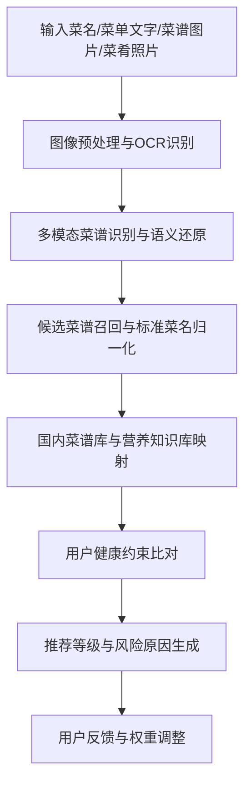

# 基于多模态菜谱理解与个性化健康比对的智能菜品推荐系统

## 摘要

本项目面向日常饮食管理、健康菜谱筛选和家庭点餐决策场景，设计一套基于人工智能的多模态菜谱理解与个性化健康推荐系统。系统以菜名、菜单文字、菜谱图片和菜肴照片为输入，通过图像预处理、OCR 文字识别、菜谱语义解析、候选菜谱召回、营养知识映射和健康约束比对，自动判断菜品是否适合用户食用，并给出可解释的推荐理由。与传统 OCR 工具和普通菜谱平台相比，本项目不只完成“看见文字”，而是进一步解决“理解菜品、匹配菜谱、判断风险、解释原因”的连续任务。

系统优先使用国内中式菜谱与营养数据源，包括 CookBook-KG 中式菜谱知识图谱、老乡鸡公开标准化菜谱、中国营养学会食物成分表和《中国居民膳食指南（2022）》等；国外营养库和菜谱 API 仅作为扩展补充。项目围绕“数据、算力、算法”三要素构建技术方案：以结构化菜谱、食材营养表和用户健康约束作为数据基础，以 OCR、视觉识别和文本解析能力作为算力支撑，以多模态识别、相似度匹配、规则推理和反馈权重调整作为算法核心。

本系统的创新点主要体现在三方面：一是多模态菜谱识别与语义还原算法，解决复杂、模糊、歧义菜名难以理解的问题；二是标准菜谱库与营养知识库联动的健康比对引擎，解决菜谱信息与个人健康约束难以自动关联的问题；三是用户反馈驱动的可解释推荐机制，解决推荐结果缺乏依据、难以持续优化的问题。项目具有较强的生活实用性、人工智能综合应用价值和后续扩展空间。

**关键词：** 多模态识别；菜谱理解；营养知识库；健康比对；可解释推荐

## 一、引言

### 1.1 研究背景

随着居民健康意识提升，越来越多家庭开始关注饮食结构、营养摄入和慢病风险控制。用户在选择菜品时，往往需要综合考虑口味偏好、食材禁忌、过敏风险、控糖控盐需求以及减脂、增肌、儿童饮食等目标。然而现实中的菜谱信息来源复杂，既可能来自纸质菜单、网络截图、手写菜谱，也可能只是一个菜名或一张菜肴照片。普通用户很难在短时间内准确判断菜品的主要食材、烹饪方式和潜在健康风险。

现有工具存在明显局限。传统 OCR 工具只能将图片转为文字，无法理解“鱼香肉丝”“蚂蚁上树”等菜名背后的真实食材含义；普通菜谱平台通常依赖用户手动搜索，难以根据个人健康信息自动筛选；部分营养计算工具要求用户准确输入食材克重，但真实菜单和菜肴照片往往并不提供完整配方。因此，面向真实生活场景，需要一种能够融合文字、图片、菜谱知识和营养规则的智能推荐系统。

### 1.2 研究目的

本项目希望解决以下问题：

1. 如何在菜单图片、菜谱截图、菜肴照片等复杂输入下识别并理解菜品信息。
2. 如何将模糊菜名、OCR 文本和图片特征转化为标准菜名、候选食材、烹饪方式和风险标签。
3. 如何优先利用国内中式菜谱数据和权威营养知识，对菜品进行健康约束比对。
4. 如何输出可解释的推荐结果，让用户知道“为什么推荐”或“为什么不推荐”。
5. 如何通过用户反馈持续调整推荐权重，使系统更符合个人饮食习惯。

### 1.3 研究价值

本项目具有三方面价值。第一，实用价值：降低用户查询菜谱和判断健康风险的成本，帮助家庭、学生和慢病管理人群进行更科学的饮食选择。第二，技术价值：将 OCR、视觉识别、文本结构化、知识库匹配和推荐规则整合成完整 AI 流程，体现跨工具集成能力。第三，社会价值：引导青少年从真实生活问题出发使用人工智能，体现“智能赋能生活，创新解决问题”的赛事主题。

## 二、相关工作

### 2.1 OCR 与菜谱识别

OCR 技术已经广泛用于票据、文档和图片文字识别，但菜谱场景具有特殊性。菜谱图片可能存在光照不均、拍摄倾斜、字体复杂、菜名艺术化、手写备注和排版混乱等问题。更重要的是，OCR 输出的原始文字不能直接用于健康推荐。例如“少许盐”“低盐”“酱油腌制”都与钠摄入有关，但含义和风险程度不同。因此，本项目在 OCR 基础上增加菜谱语义解析和风险标签提取。

### 2.2 菜谱推荐与营养分析

传统菜谱推荐多依据热度、口味、菜系或用户浏览记录进行排序，较少结合用户健康约束进行解释性判断。营养分析工具通常依赖精确食材和用量输入，但真实菜单常常只提供菜名。为提高可用性，本项目采用“候选菜谱匹配 + 营养知识映射 + 健康规则比对”的方式，在信息不完整时给出参考性判断，并对不确定内容进行标注。

### 2.3 多模态理解与可解释推荐

近年来，多模态人工智能能够同时处理文字、图像和结构化数据。本项目借鉴多模态理解思想，将菜名、OCR 文本、菜肴照片和菜谱知识库结合起来，避免单一输入带来的误判。同时，健康推荐属于高信任场景，系统不能只输出黑盒结论，而应展示识别依据、营养依据和命中规则，使用户能够理解并修正结果。

## 三、实现方法

### 3.1 系统总体思路

系统采用端到端流程，将用户输入逐步转化为可解释推荐结果：

系统的核心不是单一模型，而是由多个 AI 模块和规则模块组成的闭环。各模块之间保留中间结果，包括 OCR 原文、清洗后文本、候选菜谱、匹配分数、命中规则和推荐理由，便于检查、解释和持续优化。

### 3.2 创新点与优点

**创新点一：多模态菜谱识别与语义还原算法。**  
系统融合菜名、菜单文字、菜谱图片和菜肴照片，对复杂、模糊、歧义菜名进行识别与校正。例如“鱼香肉丝”不能按字面理解为含鱼菜品，“招牌小炒”需要结合图片和候选菜谱推断食材。系统输出标准菜名、菜品类别、可能食材、烹饪方式和置信度，解决仅凭菜名难以理解真实菜谱的问题。

**创新点二：标准菜谱库与营养知识库联动的健康比对引擎。**  
系统优先使用国内结构化菜谱和营养知识源，将识别出的菜名、食材和做法映射为营养标签、过敏标签和风险标签，再与用户健康信息进行比对。它不是简单按热度推荐，而是根据“这道菜包含什么、怎么做、对该用户有什么风险”进行判断。

**创新点三：用户反馈驱动的可解释推荐机制。**  
系统将推荐结论拆解为识别依据、营养依据、命中规则和风险提示，并记录用户接受、拒绝、收藏和修改行为。后续推荐可根据反馈调整口味偏好、禁忌权重和排序权重，使结果逐步贴合个人饮食习惯。若后续积累足够反馈数据，可进一步用于排序模型或强化学习优化。

### 3.3 数据来源与知识库构建

本项目采用“国内数据源优先，国外数据源扩展”的原则。

| 数据类别 | 当前主依赖来源 | 用途 | 状态说明 |
| --- | --- | --- | --- |
| 中式菜谱数据 | CookBook-KG 中式菜谱知识图谱 | 菜名、食材、调料、做法、口味匹配 | 已作为本地结构化候选库和在线 fallback 使用 |
| 营养规则与本地量化 | 本地营养知识库 + 标准菜谱量化样例 | 风险标签、解释规则、标准配方量化 | 当前主依赖能力 |
| 在线视觉增强 | 百度菜品识别 | 菜肴图候选识别增强 | 已完成最小成本实测，默认按需调用 |
| 国外扩展 | USDA FoodData Central | 国内数据缺失或国际食材补充 | 已作为扩展 fallback 使用 |
| 未来扩展来源 | 老乡鸡标准化菜谱、中国营养学会资源库、FoodWake、NutriData | 标准菜谱导入、权威资料校核、营养增强 | 当前不作为运行时主依赖，放入附录规划 |

菜谱匹配流程为：输入菜名、OCR 文本或菜肴照片后，系统先进行标准菜名归一化，再从菜谱库召回候选菜谱，并根据菜名相似度、食材重合度、做法一致度和图片辅助特征进行排序。营养匹配流程为：候选菜谱食材映射到标准食材名，查询每 100g 营养值，并在有克重数据时估算总营养；当菜谱缺少明确用量时，系统使用常见用量范围和风险标签给出参考判断，并标注“不确定”或“建议人工确认”。

### 3.4 数据、算力、算法三要素

**数据。** 系统数据包括菜名别名库、结构化中式菜谱库、食材营养成分表、膳食指南规则、用户健康约束和用户反馈记录。其中用户健康约束可包含过敏源、疾病禁忌、饮食偏好、营养目标和忌口说明。

**算力。** OCR、图像识别和文本语义解析可调用本地模型或云端 AI 服务完成；菜谱匹配、规则比对和推荐排序属于轻量计算，可在本地或普通服务器运行。比赛演示阶段可优先使用稳定的本地候选库，降低网络接口不稳定风险。

**算法。** 系统使用图像预处理、OCR 识别、菜名归一化、文本结构化、相似度匹配、规则推理、推荐排序和反馈权重更新等算法。对于低置信度结果，系统不强行给出确定结论，而是提示用户补充信息或人工确认。

### 3.5 稳定性、可解释性与自动运行保障

系统通过模块化流程保障稳定性。每一步都有明确输入输出，便于定位错误。OCR 结果先经过文本清洗和结构化，再进入推荐模块，避免识别错误直接影响最终结论。

系统通过结构化字段保障可控性。推荐判断基于标准菜名、食材、做法、营养标签和健康规则，而不是直接由模型生成结论。

系统通过规则库和中间结果保障可解释性。推荐结果会显示命中的规则，例如“检测到虾类食材，用户设置海鲜过敏，因此不推荐”“该菜可能含较高油脂，减脂目标用户建议控制摄入”。

系统通过降级策略保障自动运行。当网络接口不可用时，使用本地菜谱库；当营养数据缺失时，使用风险标签；当识别置信度低时，提示重新上传或人工确认；当多个候选菜谱相似时，显示候选项供用户选择。

## 四、实验与结果

### 4.1 实验设计

为验证系统效果，建议从识别、匹配、健康比对和解释性四个层面进行测试。由于当前报告材料尚未提供完整实测数据，以下表格作为项目测试记录模板。正式提交前应将“建议实测填写”替换为真实测试结果。

| 测试项目 | 测试内容 | 指标 | 结果 |
| --- | --- | --- | --- |
| OCR 识别 | 清晰菜单、模糊菜单、倾斜图片、手写备注 | 文字识别准确率、字符错误率 | 建议实测填写 |
| 多模态识别 | 菜名 + 照片、菜单文字 + 照片 | 标准菜名识别正确率 | 建议实测填写 |
| 候选菜谱匹配 | 常见菜、歧义菜名、地方菜名 | Top-1/Top-3 匹配准确率 | 建议实测填写 |
| 健康比对 | 过敏、控糖、低盐、减脂场景 | 规则命中正确率 | 建议实测填写 |
| 推荐解释 | 推荐、谨慎、不推荐样例 | 理由完整性、用户可理解性 | 建议实测填写 |

### 4.2 对比实验方案

| 对比对象 | 局限 | 本系统改进 |
| --- | --- | --- |
| 普通 OCR 工具 | 只能输出文字，无法理解菜谱含义 | 增加菜谱结构化、候选匹配和风险标签 |
| 普通菜谱平台 | 依赖手动搜索，推荐多按热度或口味排序 | 结合用户健康约束输出个性化判断 |
| 简单关键词匹配 | 容易误判歧义菜名和别名 | 使用标准菜名归一化、食材重合度和做法一致度 |
| 单一营养计算器 | 需要用户输入精确克重 | 缺少克重时提供参考估算和不确定提示 |

### 4.3 推荐结果示例

| 输入 | 用户约束 | 系统判断 | 推荐理由 |
| --- | --- | --- | --- |
| 番茄炒蛋 | 鸡蛋过敏 | 不推荐 | 候选菜谱主要食材包含鸡蛋，命中过敏源规则 |
| 红烧肉 | 减脂目标 | 谨慎食用 | 菜品通常含五花肉、油脂和糖，热量风险较高 |
| 清蒸鲈鱼 | 低油饮食 | 推荐 | 烹饪方式为蒸，油脂风险较低，蛋白质来源较优 |
| 鱼香肉丝 | 海鲜过敏 | 可进一步确认 | 标准菜名通常不含鱼类，但需核对具体配方 |

这些示例体现系统的可解释性：推荐结论不是黑盒输出，而是由菜谱匹配结果、营养知识和用户规则共同推导。

### 4.4 预期成果

系统完成后可实现以下成果：

1. 支持菜名、菜单文字、菜谱图片和菜肴照片等多种输入。
2. 自动输出标准菜名、候选食材、烹饪方式、营养标签和风险标签。
3. 根据用户健康约束给出推荐、谨慎或不推荐等级。
4. 展示推荐理由和命中规则，便于用户理解和修正。
5. 记录用户反馈，用于后续推荐权重调整。

## 五、结论与展望

### 5.1 结论

本项目围绕真实生活中的饮食选择问题，设计了多模态菜谱理解与个性化健康推荐系统。系统将 OCR 识别、菜谱语义解析、国内菜谱库匹配、营养知识映射、健康约束比对和用户反馈机制整合为完整闭环，能够从“识别菜谱”进一步走向“理解菜品”和“解释推荐”。与普通 OCR 和传统菜谱推荐相比，本项目更强调人工智能在真实场景中的综合应用能力、可解释性和实用价值。

项目符合“智能赋能生活，创新解决问题”的赛事主题，也体现了 AI 技术应用、研究实践完整性和创新性三个初赛评分重点。尤其是在中式菜谱场景下，系统优先使用国内数据源，更贴合本地用户饮食习惯和比赛应用背景。

### 5.2 展望

后续可从四方面继续完善。第一，扩充中式菜谱库和别名库，提升地方菜、家常菜和模糊菜名识别能力。第二，接入经验证的国内 API，增强菜品识别、食材识别和营养查询能力。第三，完成真实测试集采集，量化 OCR 准确率、菜谱匹配准确率、健康比对正确率和响应时间。第四，在积累用户反馈后，引入排序模型或强化学习方法，使推荐结果更加个性化。

## 六、参考文献

[1] 中国营养学会. 中国食物成分表[M]. 北京: 北京大学医学出版社.

[2] 中国营养学会. 中国居民膳食指南（2022）[M]. 北京: 人民卫生出版社, 2022.

[3] ngl567. CookBook-KG: 中式菜谱知识图谱[OL]. https://github.com/ngl567/CookBook-KG.

[4] 老乡鸡. 老乡鸡菜品溯源报告与标准化菜谱[OL]. https://github.com/laoxiangji/recipes.

[5] USDA Agricultural Research Service. FoodData Central[OL]. https://fdc.nal.usda.gov/.

[6] Open Food Facts. Open Food Facts Database[OL]. https://world.openfoodfacts.org/.

## 附录A 盲评合规检查清单

| 检查项 | 状态 |
| --- | --- |
| 报告正文不出现学生姓名 | 待提交前确认 |
| 报告正文不出现学校名称 | 待提交前确认 |
| 图片、截图、视频不出现个人信息 | 待提交前确认 |
| 文件名符合“项目标题-组别”要求 | 待提交前确认 |
| 实验数据均来自真实测试或标注待补充 | 待提交前确认 |
| 第三方数据源授权和使用方式已核验 | 待提交前确认 |

## 附录B 后续 Skill 设计依据

后续可将本报告生成流程设计为“AI 创想家参赛报告优化器” skill。该 skill 的输入包括比赛规则、报告模板、原始作品、获奖参考材料和数据源清单；处理流程包括抽取硬性要求、重组报告结构、补齐评分维度、生成创新点、标注待验证内容和输出 Markdown；输出包括优化版报告、待补充实验数据表、数据源核验清单、盲评合规检查和 PPT/展板提炼要点。

skill 必须遵守边界：不能编造实验数据，不能声称未实现功能已经完成，不能保证第三方 API 当前可用或授权可缓存，不能替代真实系统测试。凡是缺少证据的能力、数据和指标，都应标注为“待验证”“建议实测填写”或“可扩展方向”。

## 附录C 当前实现状态与后续修订输入（2026-05-08）

为避免报告表述与当前实现脱节，现将关键能力分为三类：

- **已实现（implemented）**：本地菜谱库 + 营养知识库联动的健康比对引擎；自动化回归样例；结构化 JSON 输出；中文可解释输出；报告对齐清单生成。
- **可降级（degradable）**：图片引用、OCR 文本、多模态输入链路目前以“输入契约 + 显式降级”方式支持；当前运行环境未直接接入真实视觉识别模型。
- **待验证（pending validation）**：用户反馈采集、反馈驱动排序权重更新、真实比赛实验指标的大规模量化验证。

后续修订报告时，凡未完成视觉模型接入、未完成反馈闭环、未完成真实实验量化的数据项，均应继续使用“待验证”“建议实测填写”或“可扩展方向”措辞。

## 附录D 创新点增强实现摘要（2026-05-08）

在 `20260508-dish-multi-verify` 特性下，系统进一步完成了以下增强：

1. **多模态图片验证链路**：基于 `pic/` 样本建立图片验证底表，并打通菜单图 OCR、菜肴图候选识别与结构化结果输出。
2. **联网能力状态验证**：对现有 fallback 与新增国内 OCR/视觉/营养增强能力建立四态记录（validated / needs_credentials / unavailable / degraded）。
3. **最小反馈闭环**：支持 accept、reject、favorite、correct_dish_name 四类反馈事件，并对后续推荐产生轻量偏置影响。
4. **标准菜谱级营养量化**：对命中标准配方的菜品输出标准份量量化结果，对无标准配方的菜品继续使用定性标签与边界说明。

后续正式修订报告正文和实验表时，应以 `specs/20260508-dish-multi-verify/validation/` 下文档与 `.agents/skills/dish-health-recommender/tests/` 中测试结果作为主要证据来源。

## 附录E 未来扩展数据源说明（2026-05-08）

以下来源当前不作为运行时主依赖，仅保留为后续扩展方向：

- **老乡鸡标准化菜谱**：适合作为标准菜谱本地导入源，用于进一步增强 `quantified_recipes.json`。
- **中国营养学会资源库**：当前更适合作为权威资料与规则依据来源，后续可考虑将其资料整理为本地规则或参考数据。
- **FoodWake / NutriData**：保留为未来营养增强 API 候选来源，待后续确认接入方式与稳定性后再启用。

